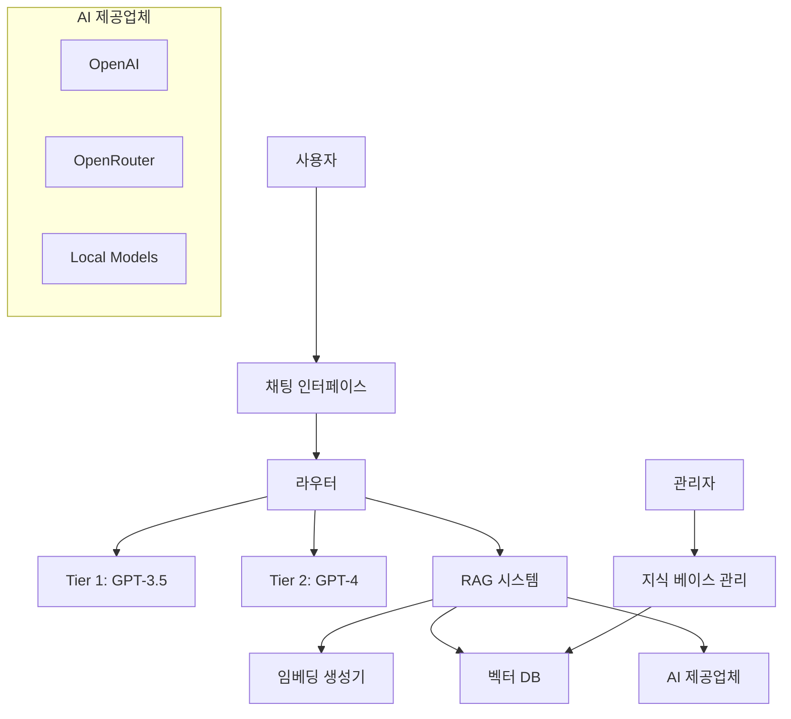

# ExcelApp AI 시스템 전체 개요

## 🎯 시스템 목표

ExcelApp의 AI 시스템은 사용자에게 최고 품질의 Excel 지원을 제공하면서도 비용 효율성을 유지하는 것을 목표로 합니다.

## 🏗️ 아키텍처 개요

### 핵심 구성 요소



### 1. 2단계 AI 시스템 (2-Tier Architecture)

**목적**: 비용 최적화와 품질 균형

- **Tier 1 (Economy)**: GPT-3.5-turbo
  - 간단한 질문 처리
  - 빠른 응답 (평균 2-3초)
  - 낮은 비용 ($0.0005/1K tokens)

- **Tier 2 (Premium)**: GPT-4
  - 복잡한 질문 처리
  - 높은 품질의 답변
  - 높은 비용 ($0.03/1K tokens)

**라우팅 로직**:
```typescript
if (intent === "simple" || preferredTier === "ECONOMY") {
  → Tier 1
} else if (intent === "complex" || preferredTier === "PREMIUM") {
  → Tier 2
} else {
  → Clarification Request
}
```

### 2. RAG 시스템 (Retrieval-Augmented Generation)

**목적**: 실제 사용자 경험 기반의 정확한 답변 제공

#### 구성 요소:
- **지식 베이스**: 한국 Excel 포럼 Q&A 데이터
- **임베딩 시스템**: OpenAI text-embedding-3-small
- **벡터 데이터베이스**: ChromaDB
- **답변 생성**: OpenRouter (DeepSeek 기본)

#### 처리 플로우:
```
사용자 질문 → 임베딩 생성 → 유사 문서 검색 → 컨텍스트 구성 → AI 답변 생성
```

### 3. 하이브리드 QA 시스템

**RAG 우선, 레거시 폴백 전략**:

```typescript
// Tier 1: 신뢰도 0.6 이상
if (ragResult.confidence > 0.6) {
  return ragAnswer;
} else {
  return tier1Answer;
}

// Tier 2: 신뢰도 0.5 이상
if (ragResult.confidence > 0.5) {
  return ragAnswer;
} else {
  return tier2Answer;
}
```

## 📊 성능 지표

### 현재 성능 (2025.01.17 기준)

| 구분 | 응답 시간 | 비용 | 품질 점수 |
|------|-----------|------|-----------|
| RAG 답변 | ~3초 | $0 | 높음 |
| Tier 1 | ~2초 | $0.0005/1K | 중간 |
| Tier 2 | ~4초 | $0.03/1K | 높음 |

### 비용 최적화 효과

- **RAG 활용 시**: 토큰 비용 0원
- **월 예상 절약**: RAG 답변 70% 적용 시 AI 비용 70% 절감
- **품질 향상**: 실제 사용자 경험 기반 답변

## 🔧 기술 스택

### AI/ML
- **OpenAI API**: GPT-3.5, GPT-4, text-embedding-3-small
- **OpenRouter**: 다양한 AI 모델 라우팅
- **ChromaDB**: 벡터 데이터베이스

### 백엔드
- **Express.js + TypeScript**: API 서버
- **Prisma + PostgreSQL**: 메타데이터 저장
- **Redis**: 캐싱 (선택사항)

### 프론트엔드
- **Remix + TypeScript**: 관리자 패널
- **Tailwind CSS + shadcn/ui**: UI 컴포넌트
- **React Query**: 상태 관리

## 🎛️ 관리자 기능

### 지식 베이스 관리 (`/admin/knowledge-base`)

1. **데이터 업로드**
   - 드래그 앤 드롭 파일 업로드
   - JSON/JSONL 형식 지원
   - 실시간 진행률 추적

2. **품질 관리**
   - 자동 데이터 검증
   - 품질 점수 계산
   - 중복 데이터 제거

3. **모니터링**
   - 실시간 통계 대시보드
   - 처리 작업 상태 추적
   - 성능 지표 조회

## 📈 향후 발전 방향

### 단기 (1-2개월)
- 사용자 피드백 수집 시스템
- A/B 테스트 프레임워크
- 성능 대시보드 강화

### 중기 (3-6개월)
- Fine-tuning 실험
- 다국어 지원 확대
- 고급 분석 기능

### 장기 (6개월 이상)
- 자체 AI 모델 개발
- 실시간 학습 시스템
- 개인화 추천 엔진

## 🔒 보안 및 개인정보

- **API 키 관리**: 환경 변수를 통한 안전한 관리
- **데이터 암호화**: 민감 정보 AES-256 암호화
- **접근 제어**: 관리자 권한 기반 접근
- **감사 로그**: 모든 AI 사용 기록 보관

## 💰 비용 분석

### 월간 예상 비용 (100명 사용자 기준)

| 구분 | 사용량 | 비용 |
|------|--------|------|
| RAG 시스템 | 70% | $0 |
| Tier 1 (GPT-3.5) | 20% | $15 |
| Tier 2 (GPT-4) | 10% | $45 |
| 임베딩 생성 | 월 1회 | $5 |
| **총계** | | **$65** |

### 기존 대비 절약 효과
- **RAG 도입 전**: $200/월 (예상)
- **RAG 도입 후**: $65/월
- **절약률**: 67.5%

---

**마지막 업데이트**: 2025.01.17  
**다음 리뷰**: 2025.02.17