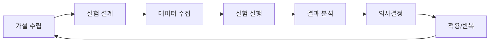

# AI 시스템 연구 주제 및 실험 계획

## 🔬 연구 철학

> "실험과 데이터 기반 의사결정을 통해 지속적으로 발전하는 AI 시스템"

### 핵심 원칙
1. **가설 기반 접근**: 모든 실험은 명확한 가설에서 시작
2. **측정 가능한 지표**: 정량적 평가가 가능한 실험 설계
3. **점진적 개선**: 작은 변화의 누적으로 큰 성과 달성
4. **사용자 중심**: 실제 사용자 경험 개선에 집중

## 🎯 현재 진행 중인 연구

### 1. RAG vs Fine-tuning 성능 비교 연구

**연구 질문**: "우리 도메인에서 RAG와 Fine-tuning 중 어느 것이 더 효과적인가?"

#### 가설
- H1: RAG는 최신 정보 반영에서 우수할 것
- H2: Fine-tuning은 응답 일관성에서 우수할 것
- H3: 하이브리드 접근이 단일 방법보다 우수할 것

#### 실험 설계
```yaml
기간: 2025.02.01 - 2025.02.28
참가자: 50명 (A/B/C 테스트)
그룹:
  - A: RAG only (17명)
  - B: Fine-tuned model only (17명)
  - C: Hybrid approach (16명)

측정 지표:
  - 답변 정확도 (전문가 평가)
  - 사용자 만족도 (1-5 점)
  - 응답 시간
  - 비용 효율성
```

#### 예상 결과 및 대응
- **RAG 우수**: RAG 시스템 고도화 집중
- **Fine-tuning 우수**: 학습 데이터 품질 개선
- **하이브리드 우수**: 현재 방향 유지 및 최적화

### 2. 한국어 Excel 용어 임베딩 최적화

**연구 질문**: "한국어 Excel 용어에 특화된 임베딩 모델을 만들 수 있는가?"

#### 현재 문제점
- 일반적인 임베딩 모델의 Excel 전문 용어 이해 부족
- 한국어와 영어 Excel 용어 혼용 시 정확도 저하
- 동의어/유의어 처리 미흡

#### 실험 계획
1. **Excel 용어 사전 구축** (2025.02)
   - 한국어-영어 Excel 용어 매핑
   - 동의어/유의어 그룹 정의
   - 사용 빈도 기반 가중치 부여

2. **커스텀 임베딩 학습** (2025.03)
   - Sentence-BERT 기반 도메인 적응
   - Excel 문서 코퍼스로 추가 학습
   - 용어 특화 손실 함수 개발

3. **성능 평가** (2025.04)
   - 기존 모델 vs 커스텀 모델 비교
   - 검색 정확도 측정
   - 사용자 만족도 조사

### 3. 멀티모달 RAG 시스템 연구

**연구 질문**: "이미지와 텍스트를 함께 활용하는 RAG 시스템의 효과는?"

#### 동기
- 사용자가 Excel 스크린샷으로 질문하는 경우 증가
- 차트/그래프 해석 요구 증가
- 시각적 정보의 맥락적 이해 필요

#### 기술 스택 후보
- **이미지 인코더**: CLIP, BLIP-2
- **멀티모달 모델**: GPT-4V, LLaVA
- **벡터 DB**: 이미지+텍스트 복합 인덱싱

#### 실험 단계
1. **프로토타입 개발** (2025.05)
   - 이미지 업로드 UI
   - 이미지-텍스트 통합 임베딩
   - 기본 검색 기능

2. **성능 최적화** (2025.06)
   - 이미지 전처리 파이프라인
   - 텍스트-이미지 가중치 조정
   - 응답 속도 개선

3. **사용자 테스트** (2025.07)
   - 실제 사용자 시나리오 테스트
   - 기존 텍스트 전용 시스템과 비교
   - ROI 분석

## 🧪 장기 연구 주제

### 1. 자율 학습 AI 시스템

**목표**: 사용자 피드백을 실시간으로 학습하는 시스템

#### 기술적 도전과제
- **온라인 학습**: 실시간 모델 업데이트
- **재앙적 망각 방지**: 이전 지식 유지
- **품질 보장**: 자동 학습된 지식의 검증

#### 연구 방향
1. **연속 학습 알고리즘** 연구
2. **메타 러닝** 적용 가능성
3. **능동 학습** 프레임워크 개발

### 2. 대화형 Excel 튜터 AI

**목표**: 개인 맞춤형 Excel 학습 도우미

#### 핵심 기능
- **적응형 커리큘럼**: 개인 수준에 맞는 학습 경로
- **실시간 피드백**: 작업 중 즉시 도움
- **학습 진도 추적**: 장기적 실력 향상 모니터링

#### 연구 주제
1. **학습자 모델링**: 개인별 학습 패턴 분석
2. **인지 부하 이론**: 적절한 학습 난이도 조절
3. **게이미피케이션**: 학습 동기 부여 메커니즘

### 3. 예측적 Excel 어시스턴트

**목표**: 사용자의 의도를 예측하여 선제적 도움 제공

#### 예측 대상
- **다음 작업 단계**: 현재 작업 기반 다음 단계 예측
- **필요한 함수**: 데이터 패턴 기반 함수 추천
- **잠재적 오류**: 일반적 실수 패턴 사전 경고

#### 기술 요소
1. **시퀀스 모델링**: RNN/Transformer 기반 작업 순서 학습
2. **이상 탐지**: 비정상적 패턴 감지
3. **추천 시스템**: 개인화된 기능 추천

## 📊 실험 관리 프레임워크

### 실험 생명주기



### 실험 문서 템플릿

```markdown
# 실험 제목

## 배경 및 동기
- 해결하려는 문제
- 비즈니스 영향

## 가설
- 주 가설
- 부가설 (있는 경우)

## 실험 설계
- 참가자/데이터
- 실험 그룹
- 통제 변수

## 측정 지표
- 주요 지표 (Primary KPI)
- 보조 지표 (Secondary KPI)
- 가드레일 지표

## 실행 계획
- 일정
- 담당자
- 리소스 요구사항

## 예상 결과 및 대응 계획
- 시나리오별 대응 방안
- 중단 조건
```

### 실험 우선순위 평가

| 기준 | 가중치 | 설명 |
|------|--------|------|
| 사용자 영향 | 30% | 실험 결과가 사용자 경험에 미치는 영향 |
| 비즈니스 가치 | 25% | 수익/비용에 대한 직접적 영향 |
| 학습 가치 | 20% | 조직의 역량 향상에 기여하는 정도 |
| 실행 용이성 | 15% | 필요한 시간, 비용, 복잡도 |
| 위험도 | 10% | 실패 시 부정적 영향의 크기 |

## 🎯 2025년 실험 로드맵

### Q1 (1-3월): 기반 기술 검증
- ✅ RAG 시스템 구축 및 검증
- 🔄 RAG vs Fine-tuning 비교 연구
- 📋 한국어 Excel 용어 사전 구축
- 📋 기본 A/B 테스트 프레임워크

### Q2 (4-6월): 품질 향상 실험
- 📋 커스텀 임베딩 모델 개발
- 📋 멀티모달 RAG 프로토타입
- 📋 개인화 알고리즘 실험
- 📋 응답 시간 최적화 연구

### Q3 (7-9월): 고급 기능 연구
- 📋 멀티모달 RAG 시스템 완성
- 📋 자율 학습 시스템 프로토타입
- 📋 대화형 튜터 기본 기능
- 📋 예측 알고리즘 연구

### Q4 (10-12월): 통합 및 최적화
- 📋 시스템 통합 테스트
- 📋 성능 벤치마크
- 📋 사용자 장기 추적 연구
- 📋 2026년 연구 계획 수립

## 🤝 외부 협력 연구

### 학계 협력
- **서울대학교 AI연구원**: 멀티모달 AI 공동 연구
- **KAIST 전산학부**: 온라인 학습 알고리즘 연구
- **고려대학교 경영학과**: 사용자 행동 분석 연구

### 산업계 협력
- **Microsoft Korea**: Office 365 연동 기술 협력
- **OpenAI**: 최신 모델 베타 테스트 참여
- **네이버 클로바**: 한국어 NLP 기술 공유

### 오픈소스 기여
- **ChromaDB**: 한국어 처리 개선 기여
- **LangChain**: Excel 전용 도구 체인 개발
- **Hugging Face**: 한국어 Excel 데이터셋 공개

## 📈 연구 성과 측정

### 단기 지표 (분기별)
- **논문/기술 보고서** 수: 목표 2개/분기
- **특허 출원** 수: 목표 1개/분기
- **오픈소스 기여**: 목표 월 2회 이상
- **컨퍼런스 발표**: 목표 분기 1회

### 장기 지표 (연간)
- **시스템 성능 개선**: 답변 정확도 +15%
- **비용 효율성**: AI 비용 -30%
- **사용자 만족도**: NPS +20점
- **기술 혁신**: 특허 등록 3개 이상

## 💡 아이디어 파이프라인

### 브레인스토밍 세션 (월 1회)
- **참가자**: 개발팀, PM, 디자이너
- **주제**: 사용자 문제점, 기술 트렌드, 경쟁사 분석
- **결과물**: 아이디어 백로그 업데이트

### 해커톤 (분기 1회)
- **목적**: 혁신적 아이디어의 빠른 프로토타이핑
- **주제**: AI 신기능, 사용자 경험 개선
- **결과**: MVP 또는 연구 프로젝트 시작점

### 외부 인사이트 수집
- **사용자 인터뷰**: 월 10명
- **전문가 자문**: 분기 2회
- **기술 컨퍼런스**: 연 4회 참석

---

**연구 책임자**: Kevin  
**마지막 업데이트**: 2025.01.17  
**다음 리뷰**: 2025.02.17