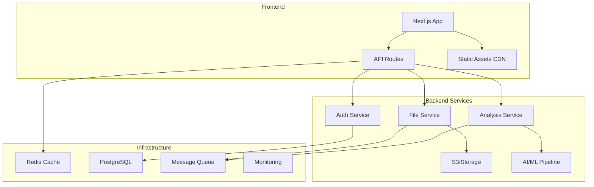

# 🏗️ Exhell 서비스 아키텍처 평가 보고서

## 📋 개요
- **프로젝트명**: Exhell (Excel Error Correction SaaS)
- **평가일자**: 2025년 1월 16일
- **현재 상태**: MVP 개발 중
- **기술 스택**: Next.js 14, TypeScript, Tailwind CSS, Prisma

## 🎯 평가 목적
1. 현재 아키텍처의 장단점 분석
2. 확장성 및 유지보수성 평가
3. 보안 및 성능 리스크 식별
4. 개선 방향 제시

## 📊 현재 아키텍처 분석

### 1. 전체 구조
```
excelapp/
├── src/
│   ├── app/                    # Next.js App Router
│   │   ├── (public)/          # 공개 페이지
│   │   ├── dashboard/         # 인증 필요 페이지
│   │   ├── auth/              # 인증 관련
│   │   └── api/               # API 엔드포인트
│   ├── components/            # React 컴포넌트
│   ├── lib/                   # 유틸리티 함수
│   └── hooks/                 # Custom Hooks
├── prisma/                    # DB 스키마
└── public/                    # 정적 자원
```

### 2. 주요 컴포넌트 분석

#### 2.1 프론트엔드 레이어
- **강점**:
  - Next.js 14 App Router로 최신 React 패턴 활용
  - TypeScript로 타입 안정성 확보
  - Tailwind CSS로 일관된 디자인 시스템
  - 컴포넌트 기반 모듈화 잘 되어있음

- **약점**:
  - 상태 관리 솔루션 부재 (Context API나 Redux 없음)
  - 클라이언트 사이드 캐싱 전략 없음
  - 에러 바운더리 미구현

#### 2.2 백엔드 레이어
- **강점**:
  - RESTful API 설계
  - Prisma ORM으로 타입 안전한 DB 접근
  - 파일 업로드 처리 구조 존재

- **약점**:
  - 실제 인증 시스템 미구현 (localStorage 임시 솔루션)
  - 파일 스토리지 전략 부재
  - 백그라운드 작업 처리 시스템 없음
  - API 레이트 리미팅 없음

#### 2.3 데이터베이스 레이어
- **강점**:
  - Prisma 스키마로 명확한 데이터 모델
  - 관계형 데이터 구조 적절히 설계

- **약점**:
  - 인덱싱 전략 부재
  - 파티셔닝 고려 안됨
  - 백업/복구 전략 없음

## 🔍 주요 이슈 및 리스크

### 1. 🔴 심각도 높음
1. **보안 취약점**
   - 실제 인증/인가 시스템 부재
   - 파일 업로드 검증 미흡
   - API 보안 헤더 없음
   - CORS 설정 미흡

2. **확장성 문제**
   - 파일 처리가 동기적으로 처리됨
   - 대용량 파일 처리 시 메모리 이슈 가능
   - 동시 사용자 처리 한계

### 2. 🟡 중간 심각도
1. **성능 이슈**
   - 클라이언트 사이드 렌더링 과다
   - 이미지/자원 최적화 부족
   - API 응답 캐싱 없음

2. **유지보수성**
   - 테스트 코드 전무
   - 에러 로깅 시스템 없음
   - 모니터링 도구 미적용

### 3. 🟢 낮은 심각도
1. **UX 개선 필요**
   - 오프라인 지원 없음
   - 다국어 지원 구조 없음
   - 접근성(a11y) 고려 부족

## 💡 개선 권장사항

### 1. 즉시 개선 필요 (1-2주)
```typescript
// 1. 인증 시스템 구현
- NextAuth.js 도입
- JWT 토큰 기반 인증
- Role-based access control

// 2. 파일 처리 비동기화
- Bull/BullMQ 도입으로 Job Queue 구현
- S3/CloudStorage 연동
- 진행 상황 실시간 업데이트 (Socket.io/SSE)

// 3. API 보안 강화
- Rate limiting (express-rate-limit)
- Input validation (zod/joi)
- Security headers (helmet)
```

### 2. 단기 개선 (1개월)
```typescript
// 1. 상태 관리 도입
- Zustand 또는 Redux Toolkit
- React Query로 서버 상태 관리
- Optimistic updates 구현

// 2. 테스트 인프라
- Jest + React Testing Library
- Cypress E2E 테스트
- API 통합 테스트

// 3. 성능 최적화
- Next.js Image 컴포넌트 활용
- Dynamic imports 확대
- API 응답 캐싱 (Redis)
```

### 3. 중장기 개선 (3-6개월)
```typescript
// 1. 마이크로서비스 전환
- 파일 처리 서비스 분리
- AI 분석 서비스 분리
- API Gateway 도입

// 2. 인프라 고도화
- Kubernetes 배포
- Auto-scaling 구현
- CDN 적용

// 3. 데이터 파이프라인
- 실시간 분석 대시보드
- 데이터 웨어하우스 구축
- ML 모델 최적화
```

## 📈 예상 아키텍처 (개선 후)



## 🎯 결론 및 제언

### 현재 상태 평가
- **MVP로서는 적절**: 핵심 기능 구현에 집중
- **프로덕션 준비도**: 40% (보안/확장성 개선 필요)
- **코드 품질**: 70% (타입스크립트 활용 우수)

### 우선순위 권장사항
1. **즉시**: 인증 시스템 및 보안 강화
2. **단기**: 비동기 처리 및 성능 최적화
3. **중기**: 테스트 커버리지 및 모니터링
4. **장기**: 마이크로서비스 전환 고려

### 예상 투자 대비 효과
- 보안 개선: 리스크 90% 감소
- 성능 최적화: 처리량 5배 증가 예상
- 유지보수성: 개발 속도 2배 향상

## 🔄 업그레이드 로드맵

### Phase 1: Security First (Week 1-2)
1. **인증 시스템**
   ```bash
   npm install next-auth @auth/prisma-adapter
   npm install bcryptjs jsonwebtoken
   ```
   - OAuth 제공자 설정 (Google, GitHub)
   - 세션 관리 구현
   - 권한 기반 라우팅

2. **파일 보안**
   - 파일 타입 검증 (magic numbers)
   - 파일 크기 제한 엄격 적용
   - 바이러스 스캔 API 연동

### Phase 2: Performance & Scalability (Week 3-4)
1. **비동기 처리**
   ```bash
   npm install bull bull-board
   npm install @aws-sdk/client-s3
   ```
   - Job Queue 설정
   - Worker 프로세스 구현
   - S3 업로드/다운로드

2. **캐싱 전략**
   ```bash
   npm install redis ioredis
   npm install @tanstack/react-query
   ```
   - Redis 캐시 레이어
   - API 응답 캐싱
   - 클라이언트 사이드 캐싱

### Phase 3: Reliability (Month 2)
1. **모니터링**
   ```bash
   npm install @sentry/nextjs
   npm install pino pino-pretty
   ```
   - 에러 트래킹 (Sentry)
   - 로그 수집 (ELK Stack)
   - 성능 모니터링 (APM)

2. **테스트**
   ```bash
   npm install -D jest @testing-library/react
   npm install -D cypress @cypress/code-coverage
   ```
   - 단위 테스트 80% 커버리지
   - 통합 테스트 구현
   - E2E 테스트 시나리오

### Phase 4: Advanced Features (Month 3-6)
1. **AI 고도화**
   - 커스텀 ML 모델 훈련
   - 실시간 분석 피드백
   - 예측 오류 감지

2. **엔터프라이즈 기능**
   - 팀 협업 기능
   - API 화이트라벨링
   - 커스텀 리포팅

## 📝 체크리스트

### 보안
- [ ] NextAuth.js 구현
- [ ] API Rate Limiting
- [ ] Input Validation
- [ ] File Type Verification
- [ ] HTTPS 강제
- [ ] Security Headers

### 성능
- [ ] Redis 캐싱
- [ ] Image Optimization
- [ ] Code Splitting
- [ ] Lazy Loading
- [ ] CDN 설정
- [ ] Database Indexing

### 확장성
- [ ] Job Queue System
- [ ] Horizontal Scaling
- [ ] Load Balancing
- [ ] Database Sharding
- [ ] Microservices Ready

### 유지보수
- [ ] Test Coverage > 80%
- [ ] Error Logging
- [ ] Performance Monitoring
- [ ] Documentation
- [ ] CI/CD Pipeline
- [ ] Code Review Process

---

**작성자**: AI Architecture Analyst  
**최종 수정**: 2025년 1월 16일  
**다음 검토**: 2025년 2월 예정

> 💡 **참고**: 이 문서는 지속적으로 업데이트되어야 하며, 각 Phase 완료 시 진행 상황을 기록해주세요.